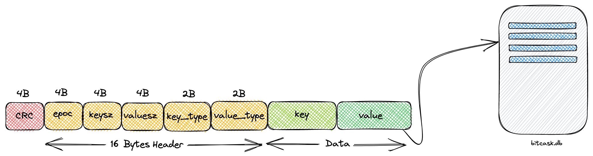

# bitcask-rb: A Log-Structured Hash Table for Fast Key/Value Data

[](https://www.ruby-lang.org/en/)
[](https://rspec.info/)
[](https://github.com/rubocop/rubocop)
[](https://dl.circleci.com/status-badge/redirect/gh/dineshgowda24/bitcask-rb/tree/main)
[](https://codecov.io/gh/dineshgowda24/bitcask-rb)
[](https://deepsource.io/gh/dineshgowda24/bitcask-rb/?ref=repository-badge)



Fast, Persistent key/value store based on [bitcask paper](https://riak.com/assets/bitcask-intro.pdf) written in Ruby.
An attempt to understand and build our persistent key/value store capable of storing data enormous than the RAM. This, in any way, is not intended for production. For simplicity, implementation has ignored a few specifications from the paper.

## Prerequisites

- Ruby
- bundler

## Setup

```shell
bundle install
```

## Usage

```ruby
db_store = Bitcask::DiskStore.new('bitcask.db')

# Setting values in store using put or hash style
db_store.put("Anime", "One Piece")
db_store["Luffy"] = "Straw Hat"
db_store[2020] = "Leap Year"
db_store.put("pie", 3.1415)

# Getting values from store using get or hash style
db_store["Anime"]
db_store.get("Luffy")
db_store["pie"]
db_store.get(2020)

# Listing keys
db_store.keys

# Size of the store
db_store.store
```

## Tests

```shell
bundle exec rspec
```

## Advantages

- Simple yet powerful
- Easy to use
- Store data enormous than RAM
- Data file is OS agnostic
- Portable
- Faster read/writes
- Minimal dependecies

## Features

| Feature                               | Support            |
|---------------------------------------|--------------------|
| Persisted in disk                     | :white_check_mark: |
| Get API                               | :white_check_mark: |
| Put API                               | :white_check_mark: |
| Int, Float and String for k/v         | :white_check_mark: |
| CRC                                   | :white_check_mark: |
| Directory Support                     | :x:                |
| Delete API                            | :x:                |
| Files Merge and LSM Trees             | :x:                |

## Benchmarks

### CPU Cycles

```ruby
ruby benchmark.rb
Benchmarked with value_size of 61 bytes
                                                         user     system      total        real
DiskStore.put : 10k records                          0.027083   0.018129   0.045212 (  0.045279)
DiskStore.get : 10k records                          0.030118   0.008643   0.038761 (  0.038883)
DiskStore.put : 100k records                         0.375524   0.185587   0.561111 (  0.563386)
DiskStore.get : 100k records                         0.322530   0.098692   0.421222 (  0.422358)
DiskStore.put : 1M records                           4.616699   2.148791   6.765490 (  6.807430)
DiskStore.get : 1M records                           3.629900   1.075376   4.705276 (  4.715082)
avg_put:                                             0.000005   0.000002   0.000007 (  0.000007)
avg_get:                                             0.000004   0.000001   0.000005 (  0.000005)
```

### Iterations Per Second

```ruby
Warming up --------------------------------------
DiskStore.put : 100 records with data size: 674 Bytes
                       146.000  i/100ms
DiskStore.get : 100 records, value size: 674 Bytes
                         2.246k i/100ms
DiskStore.put : 100 records, value size: 6 Kb
                        19.000  i/100ms
DiskStore.get : 100 records, value size: 6 Kb
                         2.066k i/100ms
DiskStore.put : 100 records, value size: 660 Kb
                         1.000  i/100ms
DiskStore.get : 100 records, value size: 660 Kb
                       143.000  i/100ms
Calculating -------------------------------------
DiskStore.put : 100 records with data size: 674 Bytes
                          1.522k (±17.1%) i/s -      7.300k in   5.048182s
DiskStore.get : 100 records, value size: 674 Bytes
                         23.946k (± 5.5%) i/s -    121.284k in   5.079779s
DiskStore.put : 100 records, value size: 6 Kb
                        689.428  (±53.2%) i/s -      1.729k in   5.240029s
DiskStore.get : 100 records, value size: 6 Kb
                         20.806k (± 5.6%) i/s -    105.366k in   5.079364s
DiskStore.put : 100 records, value size: 660 Kb
                          4.419  (± 0.0%) i/s -     23.000  in   5.207703s
DiskStore.get : 100 records, value size: 660 Kb
                          3.411k (±40.8%) i/s -      8.437k in   5.245820s
```

### Iterations Per Second

```ruby
Warming up --------------------------------------
DiskStore.put : 100 records with data size: 682 Bytes
                        55.000  i/100ms
DiskStore.get : 100 records, value size: 682 Bytes
                         2.773k i/100ms
DiskStore.put : 100 records, value size: 6 Kb
                        44.000  i/100ms
DiskStore.get : 100 records, value size: 6 Kb
                         2.429k i/100ms
DiskStore.put : 100 records, value size: 660 Kb
                         1.000  i/100ms
DiskStore.get : 100 records, value size: 660 Kb
                       439.000  i/100ms
Calculating -------------------------------------
DiskStore.put : 100 records with data size: 682 Bytes
                        542.145  (± 7.7%) i/s -      2.750k in   5.099871s
DiskStore.get : 100 records, value size: 682 Bytes
                         28.204k (± 0.9%) i/s -    141.423k in   5.014625s
DiskStore.put : 100 records, value size: 6 Kb
                        443.384  (± 3.8%) i/s -      2.244k in   5.069211s
DiskStore.get : 100 records, value size: 6 Kb
                         23.966k (± 1.6%) i/s -    121.450k in   5.068815s
DiskStore.put : 100 records, value size: 660 Kb
                         20.860  (± 9.6%) i/s -    104.000  in   5.027162s
DiskStore.get : 100 records, value size: 660 Kb
                          4.705k (±16.9%) i/s -     23.267k in   5.090618s
```

## Contributing

If you wish to contribute in any way, please fork the repo and raise a PR.

[](https://app.circleci.com/insights/github/dineshgowda24/bitcask-rb/workflows/workflow/overview?branch=main&reporting-window=last-30-days&insights-snapshot=true)